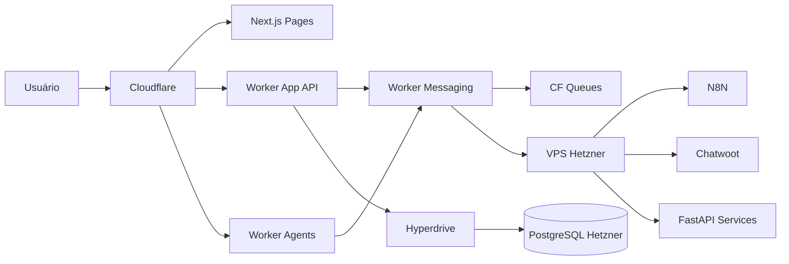

# Inova Finance AI — Documento Mestre de Arquitetura v2.0

> **Fonte única de verdade.** Substitui versões anteriores (.docx incluído).  
> **Última atualização:** 2026-06-15 | **ADR:** [ADR-001](docs/adr/ADR-001-hybrid-architecture.md)

## Visão Geral

Plataforma SaaS Enterprise **Multitenant** composta por:

- ERP Financeiro (AP, AR, Caixa, Conciliação, PIX, Tesouraria, **Agenda Financeira**)
- IA Corporativa (12 agentes de negócio + runtime embarcado)
- Automação **event-driven** (CF Queues + Outbox/Inbox)
- N8N (workflows por tenant)
- Chatwoot (WhatsApp, Telegram, Instagram)
- OCR Inteligente (VPS FastAPI)
- BI (fase posterior)
- Mobile PWA (Fase 2)
- Agentic Runtime (Cloudflare Agents SDK)

**URL produção:** `https://inovafinanceai.inovatitech.com.br`

## Módulos

### Core

- IAM com **MFA (TOTP)**
- RBAC granular
- Multiempresa / Multifilial
- Auditoria imutável
- Conformidade **LGPD** (export/delete por tenant, retenção configurável)

### Financeiro

- Contas a Pagar / Contas a Receber
- Fluxo de Caixa
- Conciliação bancária
- PIX
- Tesouraria
- **Agenda Financeira** (vencimentos, compromissos, alertas)

### CRM de Cobrança

- Inadimplência, Promissórias, Renegociação

### Estoque / Fiscal / OCR

- Estoque: Produtos, Inventário, Condicionais
- Fiscal: XML, NFe, SPED (VPS)
- OCR: Boletos, Contratos, NF (VPS + MinIO)

### Automação & Atendimento

- N8N: webhooks via Worker Messaging
- Chatwoot: omnichannel com mapeamento `conversation_id ↔ tenant ↔ cliente ERP`

## Agentes de Negócio (12)

CEO, CFO, Financeiro, Cobrança, Compras, Fiscal, Estoque, Comercial, Jurídico, Contratos, Auditor, Suporte.

Runtime: `workers/agents-runtime` (CF Agents SDK + Durable Objects). Tools restritas por RBAC.

## Arquitetura Técnica (Híbrida)

| Camada | Stack |
|--------|-------|
| Frontend | Next.js 15, React, TypeScript, Tailwind v4 |
| Edge | Cloudflare Workers (App, Messaging, Agents, Embedded) |
| VPS API | FastAPI, Python 3.12 |
| Dados | PostgreSQL, Redis, Qdrant, MinIO |
| Mensageria edge | CF Queues + Outbox/Inbox |
| Mensageria VPS | NATS (opcional, interno FastAPI) |
| Observabilidade | CF Observability + Grafana/Prometheus/Loki (VPS) |
| IA | OpenRouter, DeepSeek, GPT, Claude, Gemini, Ollama (roteamento Agente 53) |

## Bounded Contexts (Microsserviços Lógicos)

Auth, Tenant, Financial, Receivable, Payable, Inventory, Fiscal, OCR, Notification, Agent, RAG, Reporting — implementados como módulos no monorepo com ownership claro de dados.

## Segurança

1. Cloudflare WAF, Bot Fight, Turnstile, rate limit por tenant
2. JWT curto + refresh rotativo; MFA admin
3. Hyperdrive credenciais read-only por worker
4. VPS via CF Tunnel / Tailscale — sem portas públicas
5. RLS PostgreSQL + criptografia MinIO
6. LGPD: mapa de dados, retenção, export/delete

## Headers Obrigatórios

- `X-Tenant-Id`
- `X-Branch-Id`
- `X-Correlation-Id`
- `X-Idempotency-Key` (writes e eventos)

## Roadmap Revisado

| Fase | Escopo |
|------|--------|
| S1 | Foundation, Spec Kit, Infra CF/Hetzner |
| S2 | IAM, Tenant, Messaging, Prisma |
| S3 | Financeiro MVP + TDD |
| S4 | OCR + MinIO |
| S5 | N8N + Chatwoot |
| S6 | **Frontend layout (CHECKPOINT com PO)** |
| S7 | Agents Runtime (12 biz) |
| S8 | Revalidação + Deploy + Agentes embarcados 41–55 |

## Repositório

Ver `README.md` — monorepo Turborepo: `apps/`, `workers/`, `services/`, `packages/`, `infra/`, `.specify/`, `docs/adr/`.
